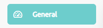
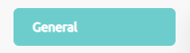
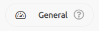

# TQUENS CSS RULE SETS

## Basic Button with 3 child divs

```html
// Basic Button with 3 child divs

<div className="button">
    <div className="btn-wrapper">
        <div className="btn-icon-wrapper">
            <icon clclassNameass="icon-feedback"></icon>
        </div>
        <div class="btn-text-wrapper">
            <p>General</p>
        </div>
        <div class="btn-info-wrapper">
            <icon className="icon-something"></icon>
        </div>
    </div>
</div>
```


## Basic Button with 2 child divs

```html
// Basic Button with 2 child divs

<div className="button">
    <div className="btn-wrapper">
        <div className="btn-icon-wrapper">
            <icon clclassNameass="icon-feedback"></icon>
        </div>
        <div class="btn-text-wrapper">
            <p>General</p>
        </div>
    </div>
</div>
```


## Basic Button with 1 divs

```html
// Basic Button with 1 divs
<div className="button">
    <div className="btn-wrapper">
        <div class="btn-text-wrapper">
            <p>General</p>
        </div>
    </div>
</div>
```


## Rounded Button

```html
// Rounded Button
<div class="button btn-rounded">
    <div class="btn-wrapper">
        <div class="btn-icon-wrapper">
            <icon class="icon-dashboard"></icon>
        </div>
        <div class="btn-text-wrapper">
            <p>General</p>
        </div>
        <div class="btn-info-wrapper">
            <icon class="icon-question"></icon>
        </div>
    </div>
</div>
```

